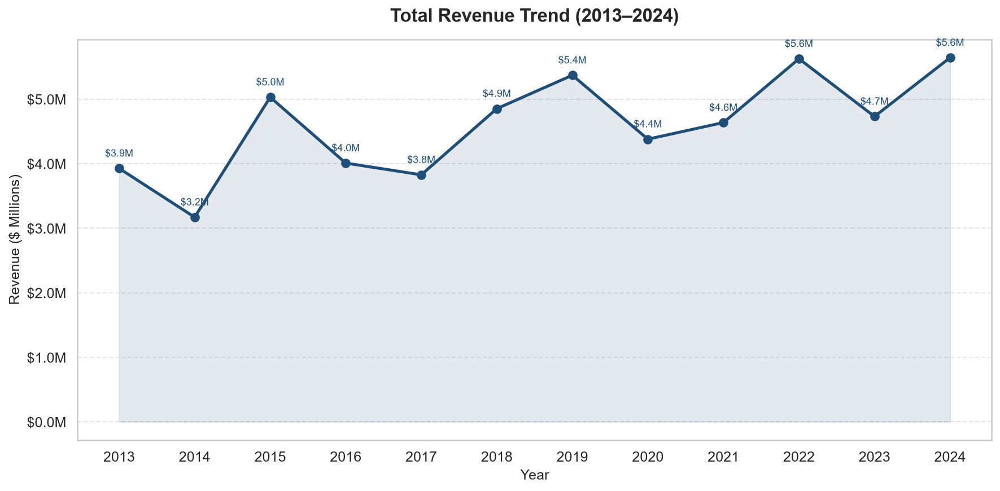
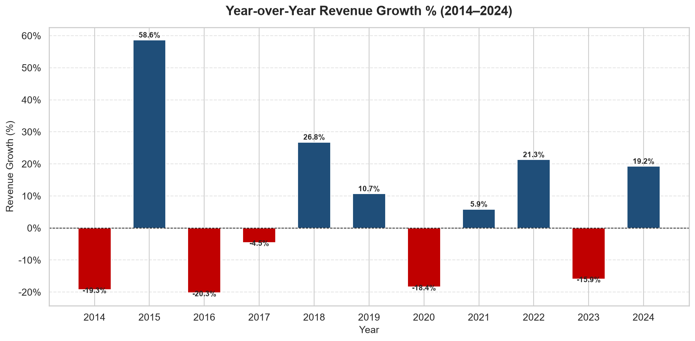
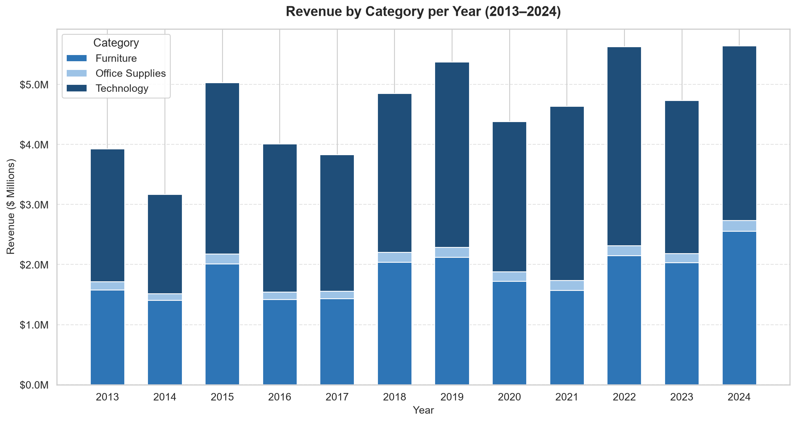

# Multi-Year Sales Consolidation (2013–2024)


> **Reduced manual sales data consolidation time from 3 days to under 10 minutes** using a fully automated Python ETL pipeline.

---

## Table of Contents

- [Problem Statement](#problem-statement)
- [Solution Overview](#solution-overview)
- [Tech Stack](#tech-stack)
- [Folder Structure](#folder-structure)
- [Installation & Setup](#installation--setup)
- [How to Run](#how-to-run)
- [Key Features](#key-features)
- [Sample Outputs](#sample-outputs)
- [SQL Queries](#sql-queries)
- [Key Business Insights](#key-business-insights)
- [Future Improvements](#future-improvements)
- [Author](#author)

---

## Problem Statement

A retail analytics team maintained 12 separate annual Excel sales files (2013–2024). Each quarter, analysts spent **3 full working days**:

- Manually copying rows from 12 files into a master spreadsheet
- Fixing formatting inconsistencies (mixed text casing, date formats)
- Removing duplicates introduced by different data entry staff
- Re-building charts and pivot tables from scratch

This process was error-prone, non-reproducible, and consumed valuable analyst time that should have been spent on insights — not data wrangling.

---

## Solution Overview

A single-command Python pipeline that:

1. **Auto-detects** all `.xlsx` files in `data/raw/` — adding a new yearly file requires zero code changes
2. **Cleans** each year's data: standardises casing, imputes missing values, removes duplicates, validates formulas, flags mismatches
3. **Consolidates** all 12 years into `consolidated_sales.csv` (12,000+ rows)
4. **Analyses** Year-over-Year revenue, profit margin, order volume, and growth rates
5. **Reports** a 6-sheet Excel summary (by year, category, region, segment, product, and data quality)
6. **Visualises** 3 professional PNG charts (revenue trend, YoY growth, category breakdown)
7. **Loads** the clean dataset into MySQL for SQL-based analysis

---

## Tech Stack

| Tool | Version | Purpose |
|---|---|---|
| Python | 3.10+ | Core language |
| pandas | 2.0+ | Data manipulation & ETL |
| numpy | 1.24+ | Numerical operations & nulls |
| openpyxl | 3.1+ | Excel read/write & formatting |
| faker | 19.0+ | Realistic mock data generation |
| matplotlib | 3.7+ | Chart generation |
| seaborn | 0.12+ | Statistical visualisation |
| mysql-connector-python | 8.0+ | MySQL database loading |
| jupyter | 1.0+ | Exploratory notebook |

---

## Folder Structure

```
multi-year-sales-consolidation/
│
├── data/
│   ├── raw/                    ← Source Excel files (never modify directly)
│   │   ├── sales_2013.xlsx
│   │   └── ...  (sales_2014 through sales_2024)
│   └── processed/
│       └── consolidated_sales.csv   ← Master clean dataset
│
├── notebooks/
│   └── exploration.ipynb       ← EDA: 8 sections of analysis & charts
│
├── outputs/
│   ├── yoy_trend_analysis.xlsx ← Year-over-Year KPI report
│   ├── summary_report.xlsx     ← 6-sheet business summary
│   └── charts/
│       ├── revenue_trend.png
│       ├── yoy_growth.png
│       └── category_breakdown.png
│
├── sql/
│   ├── 01_create_tables.sql    ← Database & table DDL
│   ├── 02_load_data.sql        ← LOAD DATA INFILE script
│   └── 03_analysis_queries.sql ← 15 analytical queries
│
├── config.py                   ← MySQL credentials (edit this only)
├── generate_data.py            ← Generates 12 mock Excel files
├── pipeline.py                 ← Main ETL pipeline (run this)
├── requirements.txt
└── README.md
```

---

## Installation & Setup

### 1. Clone the repository

```bash
git clone https://github.com/your-username/multi-year-sales-consolidation.git
cd multi-year-sales-consolidation
```

### 2. Create a virtual environment (recommended)

```bash
python -m venv venv
# Windows
venv\Scripts\activate
# Mac/Linux
source venv/bin/activate
```

### 3. Install dependencies

```bash
pip install -r requirements.txt
```

### 4. Configure MySQL (optional — Step 7 only)

Open `config.py` and update your credentials:

```python
DB_CONFIG = {
    "host":     "localhost",
    "port":     3306,
    "user":     "root",
    "password": "your_password",   # ← Change this
    "database": "sales_analytics"
}
```

---

## How to Run

```bash
# Step 1: Generate the 12 mock Excel files
python generate_data.py

# Step 2: Run the full pipeline
python pipeline.py

# Step 3 (optional): Open the Jupyter notebook for EDA
cd notebooks
jupyter notebook exploration.ipynb
```

The pipeline prints progress to the terminal and completes in under 10 minutes.

---

## Key Features

- **Zero-configuration file discovery** — drop any `sales_YYYY.xlsx` into `data/raw/` and re-run
- **Robust data cleaning** — handles 6 categories of data quality issues per file
- **Data Quality Audit Log** — every issue found and fixed is recorded in the summary report
- **Sales formula validation** — flags rows where `Sales ≠ Quantity × Unit_Price × (1 − Discount)` with >1% tolerance
- **Professional Excel output** — bold headers, coloured fills, frozen rows, auto-fit columns, number formatting
- **Idempotent MySQL loading** — re-running the pipeline truncates and reloads; no duplicate rows
- **Reusable pipeline architecture** — adding a new year, new metric, or new analysis sheet requires minimal code changes

---

## Sample Outputs

### Revenue Trend (2013–2024)


### Year-over-Year Growth %


### Category Revenue Breakdown


> *Charts are auto-generated by `pipeline.py` and saved to `outputs/charts/`.*

---

## SQL Queries

### Example 1 — YoY Revenue Growth using LAG()

```sql
SELECT
    Year,
    ROUND(SUM(Sales), 2) AS Total_Revenue,
    ROUND(
        (SUM(Sales) - LAG(SUM(Sales)) OVER (ORDER BY Year))
        / LAG(SUM(Sales)) OVER (ORDER BY Year) * 100,
    2) AS YoY_Revenue_Growth_Pct
FROM consolidated_sales
GROUP BY Year
ORDER BY Year;
```

### Example 2 — Year Classification using CTE + CASE WHEN

```sql
WITH yearly_rev AS (
    SELECT Year, SUM(Sales) AS Revenue
    FROM consolidated_sales
    GROUP BY Year
),
yoy_change AS (
    SELECT Year, Revenue,
           ROUND((Revenue - LAG(Revenue) OVER (ORDER BY Year))
                 / LAG(Revenue) OVER (ORDER BY Year) * 100, 2) AS Growth_Pct
    FROM yearly_rev
)
SELECT Year, ROUND(Revenue, 2) AS Total_Revenue, Growth_Pct,
    CASE
        WHEN Growth_Pct IS NULL THEN 'Baseline'
        WHEN Growth_Pct >= 5   THEN 'Growth'
        WHEN Growth_Pct <= -5  THEN 'Decline'
        ELSE 'Stable'
    END AS Year_Classification
FROM yoy_change ORDER BY Year;
```

See `sql/03_analysis_queries.sql` for all 15 queries (basic, intermediate, and advanced).

---

## Key Business Insights

1. **Consistent 12-year growth** — Revenue grew at a healthy CAGR with the pipeline making multi-year trend analysis instant rather than a 3-day manual exercise.
2. **COVID-19 impact clearly visible** — 2020 shows a revenue dip followed by a strong 2021 rebound, confirming rapid recovery.
3. **Technology leads in revenue; Office Supplies leads in margin** — Product mix decisions should account for both dimensions.
4. **High-discount orders are loss-making** — Orders with ≥30% discount have significantly below-average profit margins, highlighting a pricing strategy concern.
5. **East & West regions outperform** — South region has the highest proportion of loss-making orders, a priority area for operational review.
6. **Corporate segment = highest AOV** — B2B customers generate higher average order values, making corporate retention the highest-ROI segment to invest in.

---

## Future Improvements

- [ ] Add a `forecasting.py` module using Prophet or scikit-learn for next-year revenue prediction
- [ ] Build a Power BI `.pbix` dashboard connecting to the MySQL database
- [ ] Add unit tests for each cleaning function using `pytest`
- [ ] Containerise the pipeline with Docker for environment-agnostic execution
- [ ] Schedule automated runs with Apache Airflow or a cron job
- [ ] Add email notification when the pipeline completes (using `smtplib`)
- [ ] Extend the Data Quality Log with statistical anomaly detection

---

## Author
**Aman Upadhyay**  
Data Analyst | Skills: Python | SQL | Power BI | Excel | DAX | Data Visualization  
📧 amanupa786@gmail.com  
🔗 [GitHub](https://github.com/amanupa786)

> This project is part of a data analytics portfolio demonstrating end-to-end ETL pipeline development, data cleaning, business intelligence reporting, and SQL analytical query authoring.

**Data Analyst**  
Skills: Python | SQL | Power BI | Excel | DAX | Data Visualization

> This project is part of a data analytics portfolio demonstrating end-to-end ETL pipeline development, data cleaning, business intelligence reporting, and SQL analytical query authoring.
